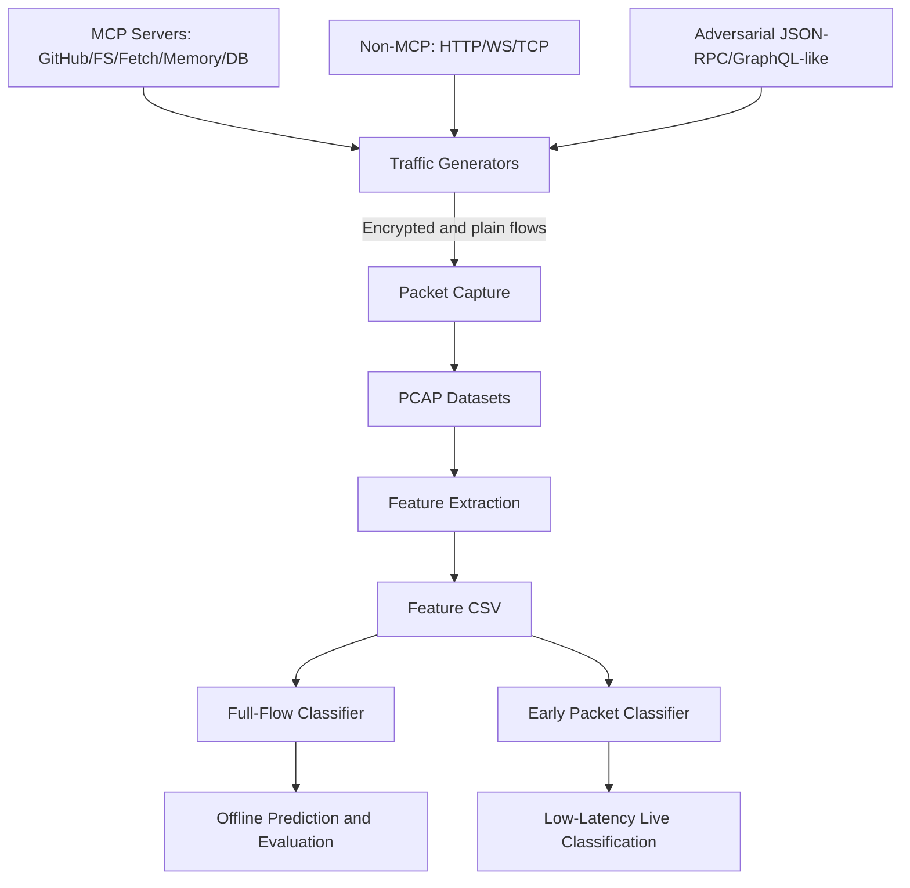

# Encrypted MCP Traffic Detection (Without Decryption)

Detect and classify Model Context Protocol (MCP) traffic inside encrypted streams using only metadata, timing, directionality, and packet-shape features.

## Executive Summary

This project identifies MCP traffic even when payloads are encrypted (TLS/HTTPS), without decrypting packet content. Instead of reading messages, the pipeline learns the shape of communication:

- Packet sizes and first-N packet patterns
- Inter-arrival timing and burst behavior
- Directionality and turn-taking signatures
- TLS record-level metadata (record types/counts/sizes)

### Key Results (Current Run Artifacts)

Based on latest saved outputs in `results/`:

- Full-flow model (XGBoost): CV F1 = 0.9994, Test Accuracy = 1.0000, Test F1 = 1.0000 on 6651 samples
- Early classifier: 99.9% CV accuracy/F1 even at 3 packets
- Sweet spot for speed/accuracy tradeoff: N = 3 packets

These metrics can vary slightly by random seeds, capture conditions, and generated traffic mix.

## Why This Project Is Different

Compared to a basic MCP vs non-MCP demo, this implementation adds:

1. Early packet classification
	The model can classify using only the first few packets (3 to 17), enabling very low-latency detection.
2. Adversarial non-MCP generation
	Includes JSON-RPC and GraphQL-like traffic crafted to mimic MCP patterns and reduce shortcut learning.
3. Diverse MCP server profiles
	Simulates five practical MCP server domains (GitHub, Filesystem, Fetch, Memory, Database).
4. End-to-end automation
	Data generation, capture, feature extraction, model training, and live inference can run from scripts on one machine.

## High-Level Architecture



## Repository Structure

- `traffic_capture/`: traffic orchestration and packet capture
- `feature_extraction/`: pcap-to-feature pipeline
- `mcp_server/`: baseline and diverse MCP servers
- `mcp_client/`: baseline and diverse MCP clients
- `non_mcp_traffic/`: HTTP/WS/TCP/external/adversarial non-MCP traffic
- `model/`: train, evaluate, predict, early classifier, live capture
- `results/`: saved reports and prediction outputs
- `bulk_generate.py`: high-throughput all-in-one generation/training script

## Requirements

- OS: Windows (project currently tuned for Windows loopback capture, but can be adapted)
- Python: 3.10+
- Npcap installed with loopback capture enabled (for `\\Device\\NPF_Loopback`)
- Git

Python dependencies are listed in `requirements.txt`.

## Setup (First Time)

Run from project root:

```powershell
cd "c:\Users\cpans\OneDrive\Desktop\Project HPE test\EncryptedMCPDetection"
python -m venv .venv
.\.venv\Scripts\Activate.ps1
python -m pip install --upgrade pip
pip install -r requirements.txt
```

Generate TLS certs for local encrypted testing:

```powershell
python generate_certs.py
```

## Quick Start (Recommended Path)

### 1) Generate Large Dataset + Train Models

```powershell
.venv\Scripts\python.exe bulk_generate.py --batches 120 --batch-duration 8
```

What this does:

- Starts diverse MCP and non-MCP servers once
- Captures traffic over many rapid client batches
- Saves MCP and non-MCP pcaps
- Extracts features
- Merges with prior dataset if available
- Trains full-flow and early packet classifiers

Expected output artifacts include:

- `data/features_bulk.csv`
- `data/features_final_v3.csv` (when merge source exists)
- `models/best_model.pkl`
- `models/early_model_n*.pkl`
- `results/training_results.txt`
- `results/early_classifier_results.txt`

### 2) Train Full Model Manually (Optional)

```powershell
.venv\Scripts\python.exe -m model.train --features data/features_final_v3.csv --output models
```

### 3) Train Early Classifier Manually (Optional)

```powershell
.venv\Scripts\python.exe model/early_classifier.py --features data/features_final_v3.csv
```

### 4) Live Real-Time Test

Terminal A (generate live traffic):

```powershell
.venv\Scripts\python.exe -m traffic_capture.orchestrator --tls --duration 60 --requests 15
```

Terminal B (classify live flows early):

```powershell
.venv\Scripts\python.exe -m model.live_capture --mode early --n-packets 5 --confidence 0.85
```

## Detailed Workflow

### A. Traffic Generation Modes

1. Baseline orchestrated run:

```powershell
.venv\Scripts\python.exe -m traffic_capture.orchestrator --tls --duration 60 --requests 50 --output-dir data/pcap
```

2. Bulk mode for large-scale datasets:

```powershell
.venv\Scripts\python.exe bulk_generate.py --batches 80 --batch-duration 8
```

3. Diverse-only generation pipeline:

```powershell
.venv\Scripts\python.exe diverse_generate.py
```

### B. Feature Extraction

```powershell
.venv\Scripts\python.exe -m feature_extraction.extractor --pcap-dir data/pcap --output data/features.csv
```

Feature families include:

- Flow duration, packets, bytes
- First-N packet sizes and directions
- Inter-arrival statistics
- TLS record counters and ratios
- Burst and idle behavior
- Direction changes and asymmetry
- TCP flags and entropy metrics

### C. Model Training and Evaluation

Train:

```powershell
.venv\Scripts\python.exe -m model.train --features data/features.csv --output models
```

Evaluate:

```powershell
.venv\Scripts\python.exe -m model.evaluate --model models/best_model.pkl --features data/test_features.csv
```

Advanced train/val/test split script:

```powershell
.venv\Scripts\python.exe model/train_val_test.py --features data/features.csv
```

### D. Inference / Prediction

Predict from pcap:

```powershell
.venv\Scripts\python.exe -m model.predict --pcap data/pcap
```

Predict from feature CSV:

```powershell
.venv\Scripts\python.exe -m model.predict --features data/features.csv --output results/predictions.csv
```

## Core Scripts to Showcase

- `bulk_generate.py`: high-throughput data generation and training automation
- `model/early_classifier.py`: first-N packet classification experiments
- `mcp_server/diverse_servers.py`: five domain-specific MCP server profiles
- `mcp_client/diverse_client.py`: realistic client behavior for each MCP server type
- `non_mcp_traffic/adversarial.py`: MCP-like negative traffic generator
- `model/live_capture.py`: low-latency live flow classification

## Reproducing the Reported Results

1. Create/activate venv and install requirements
2. Generate certs (`generate_certs.py`)
3. Run `bulk_generate.py` with enough batches for target volume
4. Confirm output reports:
	- `results/training_results.txt`
	- `results/early_classifier_results.txt`
5. Validate live mode with orchestrator + `model.live_capture`

## Notes on Data Volume and Timing

- Flow count scales primarily with `--batches`, sessions, and requests
- Early detection latency estimate is approximately:
  - $t \approx N \times 50\text{ms}$ under typical local-loopback timing
- For N = 3, practical detection can be near 150 ms depending on machine load

## Troubleshooting

1. Capture returns zero packets
	- Verify Npcap installation and loopback support
	- Run terminal as Administrator if required
2. TLS errors with self-signed cert
	- Regenerate cert with `generate_certs.py`
	- Ensure cert path is passed where needed
3. Module import issues
	- Confirm venv is active and dependencies installed
4. Live classifier missing early model file
	- Train early models first (`model/early_classifier.py`)
5. Low performance in new environment
	- Regenerate dataset with local traffic profile and retrain

## Mentor/Reviewer Talking Points

1. End-to-end reproducible pipeline
	The project automates generation, capture, extraction, training, and prediction.
2. Realistic and hard negatives
	Adversarial JSON-RPC and related protocols reduce false confidence.
3. Early classification as major contribution
	Detection from first N packets enables near real-time MCP visibility.
4. Diversity and scale
	Multiple MCP server domains and bulk flow generation improve generalization.

## License and Responsible Use

This project is for research and defensive traffic classification. Ensure all traffic generation and capture is performed only in authorized environments.